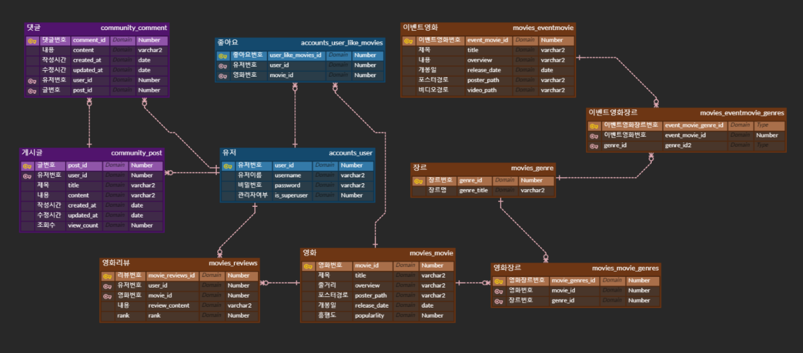
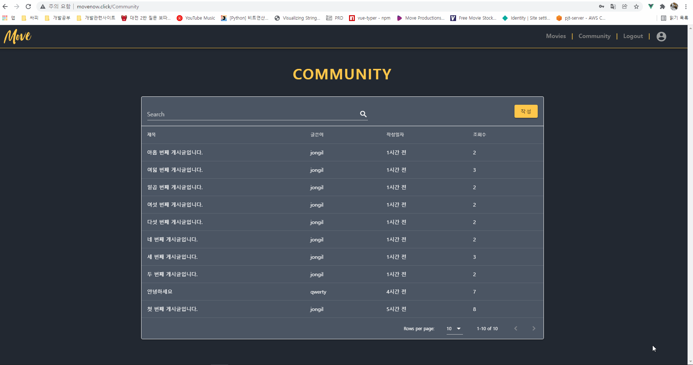
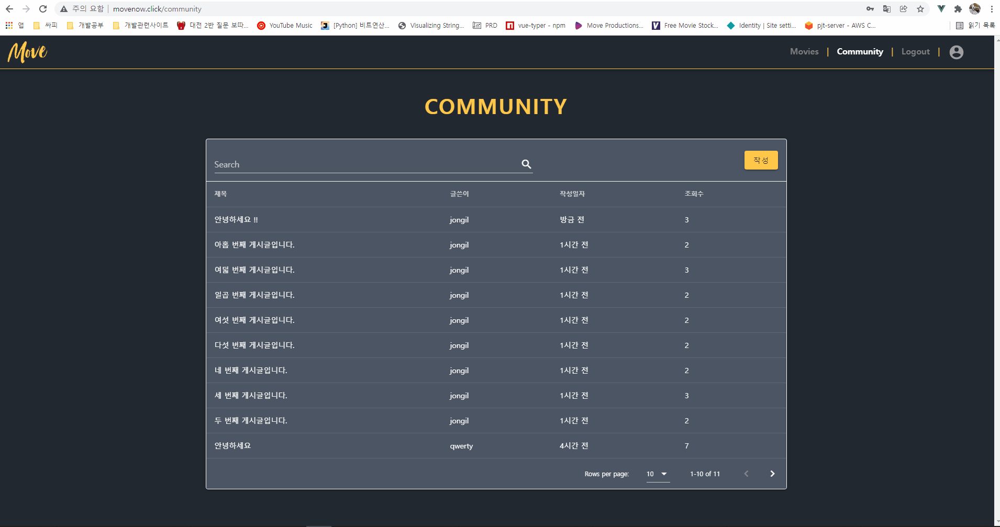
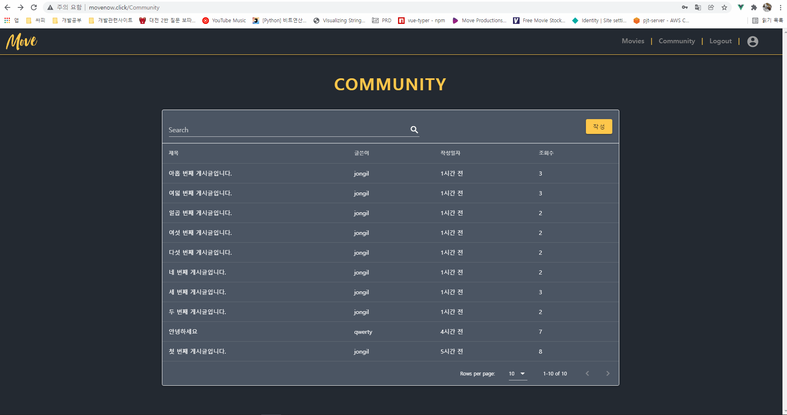
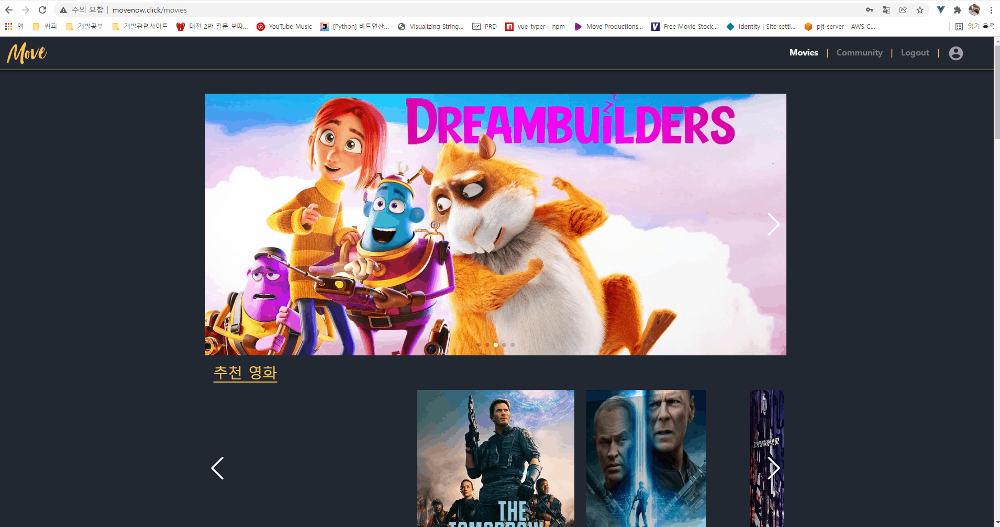

# [SSAFY] Movie Project

> #### :1학기 final project

-----

# project link

> http://movenow.click/

-----

### 개요

-----

> M O V E ! 는 영화를 소개하고 사용자에게 알맞은 영화를 추천하는 서비스입니다.
>
> 간단한 알고리즘을 통해 사용자의 영화성향을 파악,  추천 할 수 있습니다.

### 개발일정

-----

|        기간        |             진행작업              |
| :----------------: | :-------------------------------: |
| 2021. 11 / 17 ~ 18 |   기획, 데이터베이스(ERD) 구성    |
| 2021. 11 / 18 ~ 22 | 백엔드 기능 구현 및 UI 초안 기획  |
| 2021. 11 / 22 ~ 24 |       UI 구현 및 오류 수정        |
| 2021. 11 / 25 ~ 26 | 프로젝트 배포 및 마무리, 자료정리 |

### 전체 기능

-----

- ##### 가입 기능 (회원가입 / 로그인 / 로그아웃 )

- ##### 마이페이지 (좋아요 목록, 회원 선호 장르 조회)

- ##### 커뮤니티(글 작성 / 수정 / 삭제 / 필터 , 댓글 작성 / 삭제)

- ##### 리뷰(리뷰 작성 / 삭제)

- ##### 좋아요(영화 좋아요/ 좋아요 취소)

- ##### 메인페이지(각 카테고리 영화 조회 및 추천)

- ##### 백엔드 서버 배포(AWS ec2 / cloud9)

- ##### 프론트엔드 서버 배포(netlify)

### 개발 환경 및 도구

-----

- Windows OS x64
- Django 3.2.9
- Python 3.9.6
- django rest framework 3.12.4
- Vue 2.6.11
- vuetify 2.6.0
- vue-awesome-swiper 4.1.1
- vue-typer 1.2.0
- axios 0.24.0

### ERD 설계

-----

### 구현 화면

-----

|                      INTRO                      |
| :---------------------------------------------: |
|  |

|                            SIGNUP                            |                            LOGIN                             |
| :----------------------------------------------------------: | :----------------------------------------------------------: |
|                           |     |
|                             MAIN                             |                            REVIEW                            |
|                               |  |
|                         POST CREATE                          |                         POST DETAIL                          |
|                   |     |
|                           COMMENT                            |                            MYPAGE                            |
|  |                           |

-----

## [개발일지]

> - [1일차](devnote/README_1.md)
>
> - [2일차](devnote/README_2.md)
>
> - [3일차](devnote/README_3.md)
>
> - [4일차](devnote/README_4.md)
>
> - [5일차](devnote/README_5.md)
>
> - [6일차](devnote/README_6.md)
>
> - [7일차](devnote/README_7.md)

