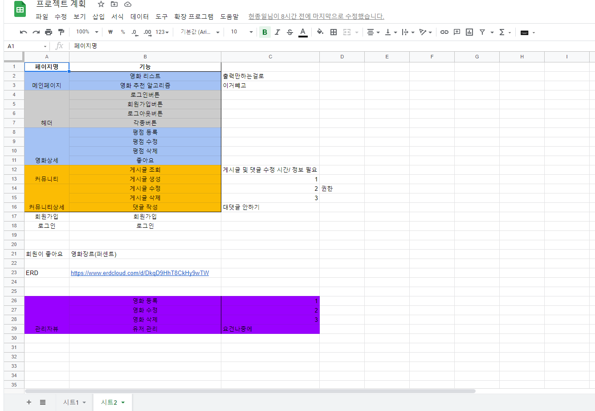
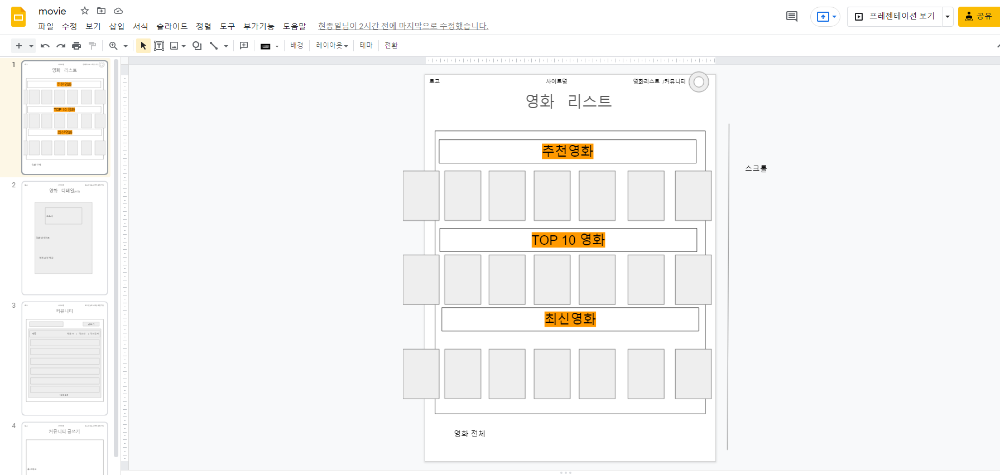
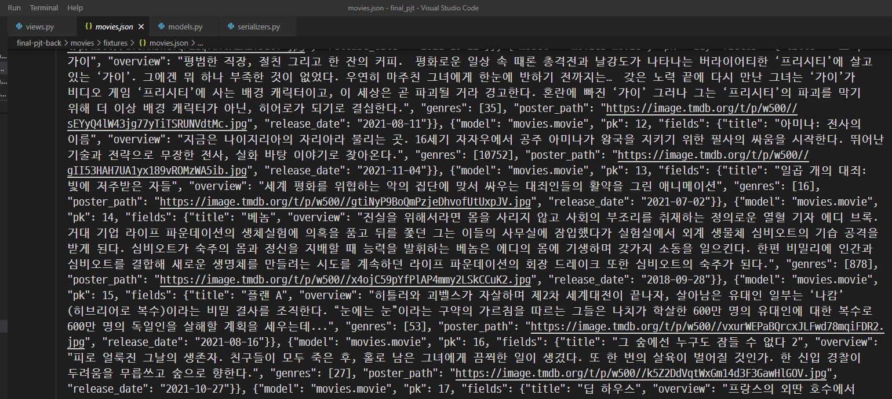
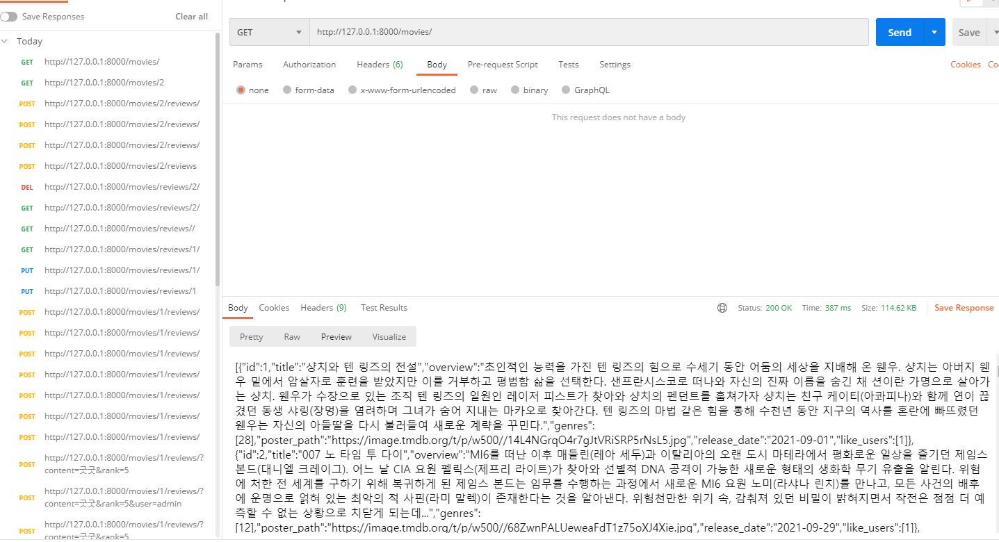

# 1117 1일차

### 대전2반 송진섭 현종일 

### final_pjt

#### 목표

- [x] 영화 데이터 100개, 장르 데이터 수집 및 json파일 생성

- [x] 프론트 와 백 CORS를 사용해 교차 출처 접근 허용

#### 역할 분담 / 할일

진섭 

- tmdb를 이용한 데이터 수집 및 json 파일 생성, movies
- movie앱(movie_list, movie_detail, movie_detail) json 응답확인  (서버) 유저는 X

종일 

- 프로트.백  CORS 이용 접근 허용
- community앱 json 응답확인

협업

- 명세서 분석 후 계획 수립
- UI 구상

​	

1. plan

   

2. UI 구상

   

3. data

   

4. movie app

   

-----

### 송진섭

> ### 배운 것

- urllib.request을 통한 json 파일 저장
- serializers 복습

> ### 어려웠던점

- 로그인을 안 만들고 movies_model에 user 필드를 만들어 post 요청시 에러발생

  => user필드를 주석처리 후 post 요청하여 해결

> ### 느낀점

- 이전 우수 프로젝트를 보고 짧은 시간에 많은 성과를 이뤄낸 것이 보여 부담된다. 그래도 오늘 목표보다 많이 해서 뿌듯한 하루이다. 어서 명세서의 내용들을 만들어내고 추가적인 기능들을 구현하고 싶다. 아이디어는 있지만 시간안에 해낼 수 있을지 걱정된다.

### 현종일

> ### 배운 것

- Serializer 복습

> ### 어려웠던점

- 작성날짜가 당일이면 6시간 전, 12시간 전 이런식으로 출력하게 만들고 싶었는데 serializer에서는 DateTimeField와 DateTime의 연산이 불가능해서 어떤식으로 해결해야 될 지 막막했습니다.

> ### 느낀점

- 일주일 이라는 시간이 넉넉할 줄 알았는데, 생각보다 많이 부족할 것 같아서 부지런히 노력해야 할 것 같습니다. 아직 Vue와 Django에 대한 이해가 많이 부족해서 공식 문서를 보면서 열심히 진행해보겠습니다!
