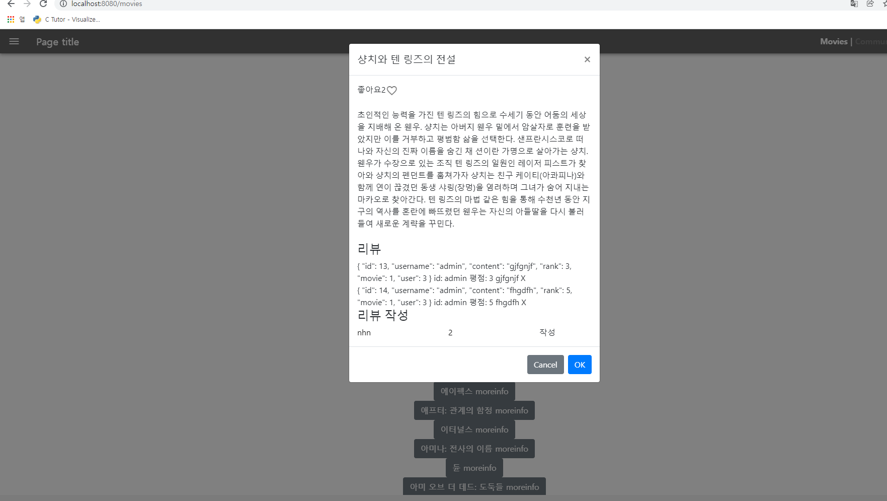
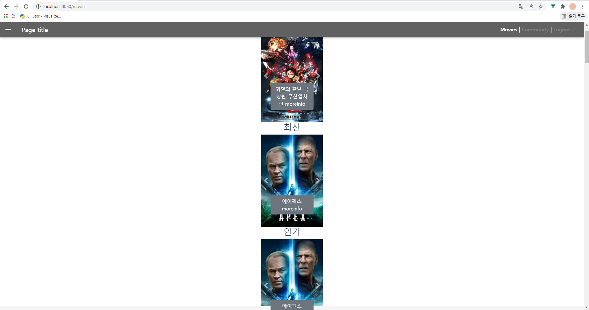
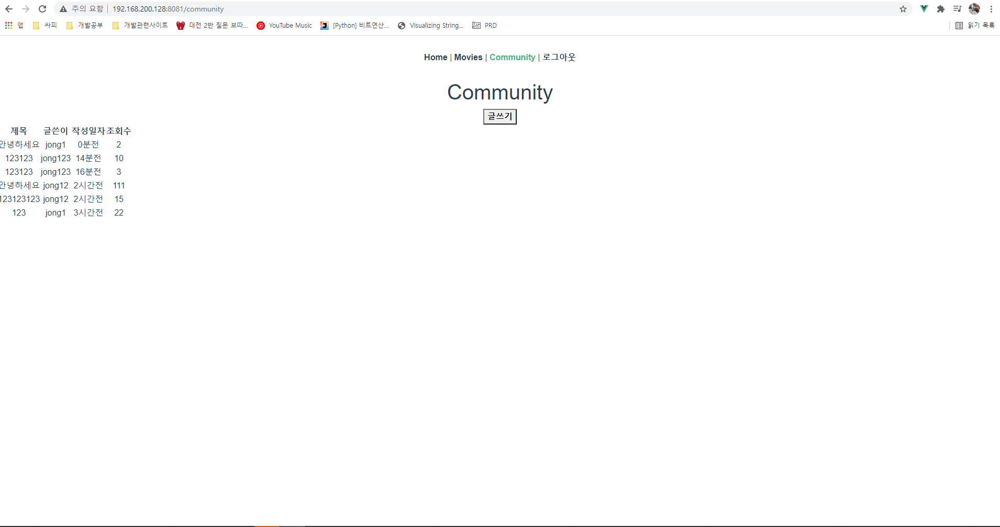
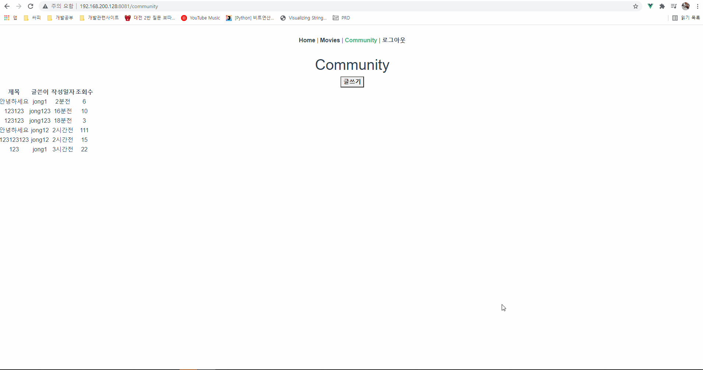
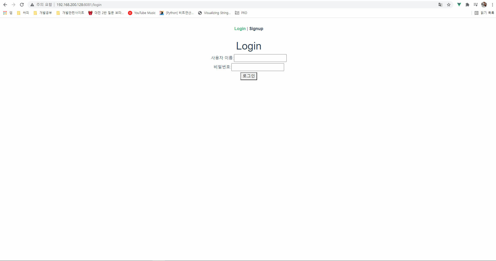

# 1118 2일차

### 대전2반 송진섭 현종일 

### final_pjt

#### 목표

- [x] json 데이터 인기도 추가 및 movie 모델 인기도 추가
- [ ] 영화 리스트 최종완성(케러셀, 모달) 
- [x] community 앱 백엔드 명세대로 완성 및 vue 연동

- [x] account 앱 백엔드 완성 및 vue 연동


#### 역할 분담 / 할일

#### 진섭 

- json 데이터 수정 및 모델 수정(인기도 추가)  

- 인기, 추천, 최신 영화리스트 응답 확인

- 전체영화리스트 클릭시 모달창 나타남

- 인기, 추천, 최신 케러셀 (모달창은 미완성)

  

#### 종일 

- community 앱 CRUD 기능 구현
- community 앱 vue 연동


#### 협업

- 하루 계획 및 목표 수립
- git branch merge 작업
- accounts 앱 기능 구현
- UI 구상


#### 	결과 진행 화면

#### 1. 전체 영화리스트 모달



#### 2. 인기 추천 최신 영화 케러셀




-----

#### 3. POST




#### 4. REVIEW




#### 5.SIGNUP & LOGIN



-----


### 송진섭

> ### 배운 것

- bpptstrap vue 활용 (모달, 케러셀)

> ### 어려웠던점

- loaddata 에러발생

  => python manage.py loaddata movies/fixtures/movies.json 경로를 모두 입력하니 해결
  
  ```vue
  $ python manage.py loaddata movies.json
  ...
      for obj in objects:
    File "C:\Users\user\Documents\jinseob\ssafy\my_ssafy_projects\final_pjt\final-pjt-back\venv\lib\site-packages\django\core\serializers\json.py", line 74, in Deserializer    
      raise DeserializationError() from exc
  django.core.serializers.base.DeserializationError: Problem installing fixture 'C:\Users\user\Documents\jinseob\ssafy\my_ssafy_projects\final_pjt\final-pjt-back\movies.json': 
  ```
  
- loaddata foreiginkey 에러

  => Movie 모델의 외래키인 genre를 포함한 genre.json 을 먼저 데이터를 넣으니 해결
  
- 케러셀 클릭시 모달 나타나게하기 (해결X)

  

> ### 느낀점

- 목표를 달성하지 못해 상당히 아쉽다. 어떻게 해야 케서셀을클릭하면 모달을 출력할 수 있을지 구조도 해결책도 생각한 것마다 실패하니 허무하다. 

- 에러가 발생하면 해결책을 찾고 또 에러가 발생하고 하루가 참 빠르게 흘러가는 데 성과는 없다.


### 현종일

> ### 배운 것

- router와 관련된 메소드가 굉장히 헷갈렸는데 어느정도 감이 잡히는 것 같습니다. 
- jwt 토큰 사용을 조금 더 능숙하게 하게 되었습니다.


> ### 어려웠던점

- 그냥 다 어렵습니다.. 특히 아직까지도 serializer에 대한 이해가 많이 부족해 공식 문서를 더 찾아보면서 이해해야 할 것 같습니다.

  

> ### 느낀점

- 이틀차인데 머리속은 일주일이 지난 것 처럼 피폐하고 힘듭니다.... 하지만 vue의 라우터 기능이 정말 유용하다고 생각되어서 공식문서를 통해 더 이해해보려고 노력중입니다.
