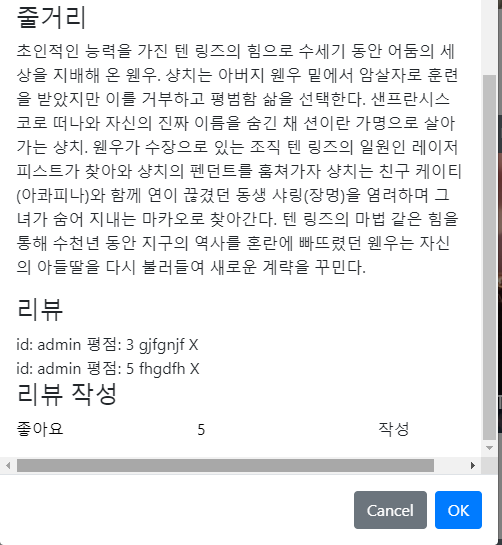

# 1119 3일차

### 대전2반 송진섭 현종일 

### final_pjt

#### 목표

- [x] 영화리뷰 댓글 생성, 삭제 구현

- [ ] 좋아요 구현


#### 역할 분담 / 할일

진섭 

- 영화 리뷰 댓글 생성, 삭제 구현
- 댓글 수정 공부


종일

- community 앱 제작 및 app 전체 UI 구상


협업

- 하루 계획 및 목표 수립
- git branch merge 작업
- 홈페이지 디자인 구상
- 상호 피드백, 디자인 구상 조율


1. 댓글 생성.삭제

   


-----


### 송진섭

> ### 배운 것

- username 가져오기

  ```python
  class ReviewSerializer(serializers.ModelSerializer):
      username = serializers.ReadOnlyField(source='user.username')
      class Meta:
          model = Review
          fields = '__all__'
          read_only_fields = ('movie', 'user')
  ```

  

> ### 어려웠던점

- 댓글 수정 구현(댓글하나씩 수정 못하고 댓글 전체가 폼이 변하는 현상 발생)

  => 댓글 수정을 구현하려 했지만 필요없는 기능이라 빼기로 함
  
  

> ### 느낀점

- 지난 밤 동안 달성하지 못한 케러셀을 만들었다. 생각한대로 하나씩 진행되니 기쁘다. 오늘은 좋아요까지 구현하려 했지만 댓글 수정방법을 공부하느라 너무 지쳤다.


### 현종일

> ### 배운 것

- vue ui 툴 중 하나인 vuetify에 대해 간략하게 사용해봤습니다.

> ### 어려웠던점

- 전체적으로 vue에 대해 아직 이해도가 많이 부족한 것 같습니다.

> ### 느낀점

- 많이 이해했다고 생각했던 부분들도 코드를 다시 보지 않으면 헷갈리는부분들이 너무 많습니다. 제대로 이해하기 위해 노력해야겠습니다.
