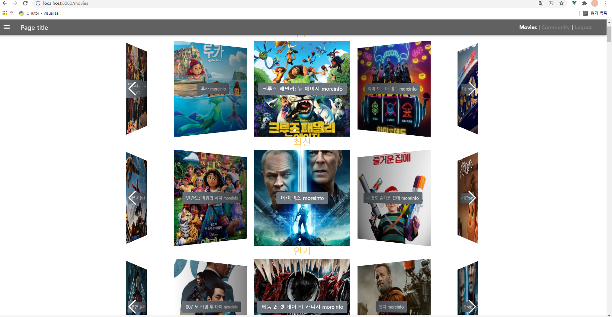
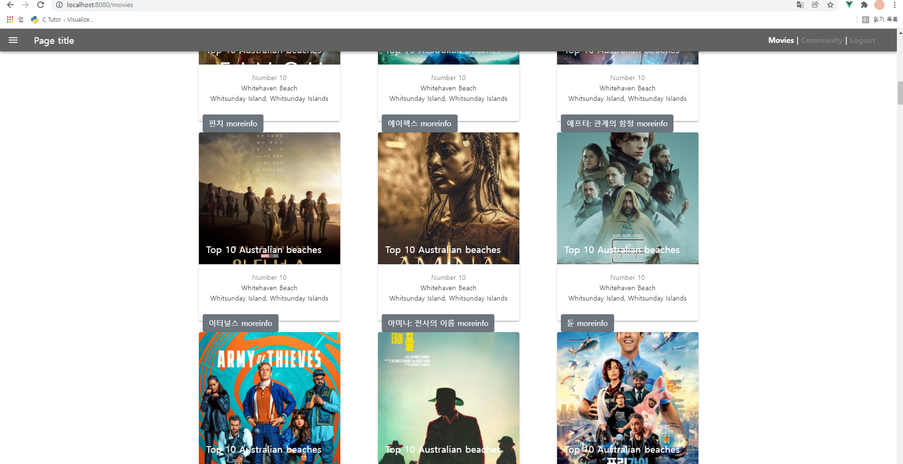

# 1120.20~21 4일차(주말)

### 대전2반 송진섭 현종일 

### final_pjt

#### 목표

- [x] 좋아요 구현

- [x] 케러셀, 영화카드 디자인 수정


#### 역할 분담 / 할일

진섭 

- 좋아요 구현
- 케러셀, 영화카드 세련되게 디자인 수정


1. 케러셀 수정

   
   
1. 영화카드

   


-----


### 송진섭

> ### 배운 것

- vue-awesome-swipe 사용법

- SlugRelatedField를 사용해 장르이름 가져오기

- vuetifyjs 사용법

  
  
  

> ### 어려웠던점

- vue-awesome-swipe가 style태그가 scss로 되어있어 에러발생 v-for로 받은 poster_path url을 어떻게 넣을지 고민이 많았다.

  => 구글링을 통해 vue-awesome-swipe 관련 자료들을 찾고 하나씩 옵션을 적용했다. 이미지 url도 구글링을 통해 해결법을 찾았다.
  
  ```vue
   <swiper-slide 
            v-for="movie in movies"
            :key="movie.id"
            :style="{'background-image': 'url('+ movie.poster_path +')'}"
          >
            <movie-card-detail :movie="movie"></movie-card-detail>
          </swiper-slide>
  ```
  
  
  
  
  

> ### 느낀점

- 자료가 적어 찾기 힘들었지만 키워드를 다시 정리하여 영어로 검색하니 자료들을 적합한 사례들을 찾을 수 있었다. 하나하나 문제를 해결하고 그것이 생각대로 실현되면 성취감도 커서 기뻤다.
