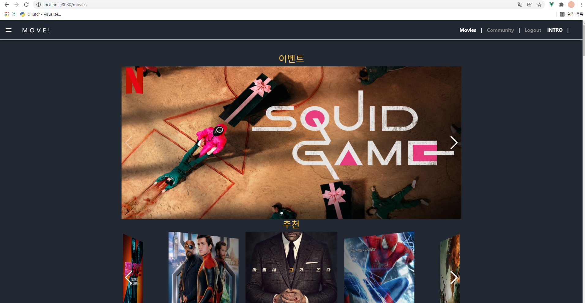
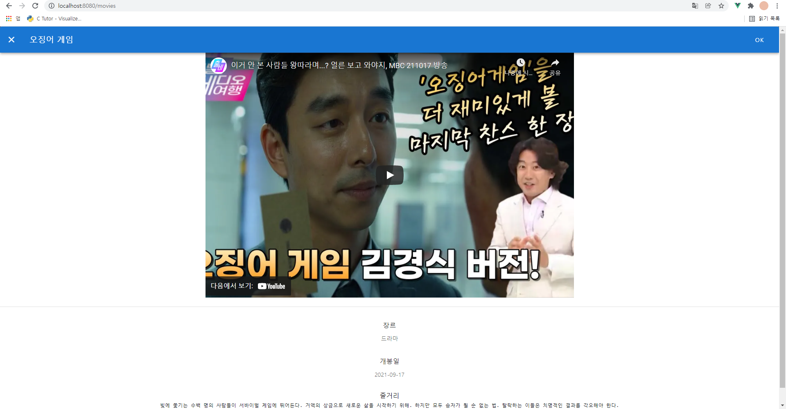
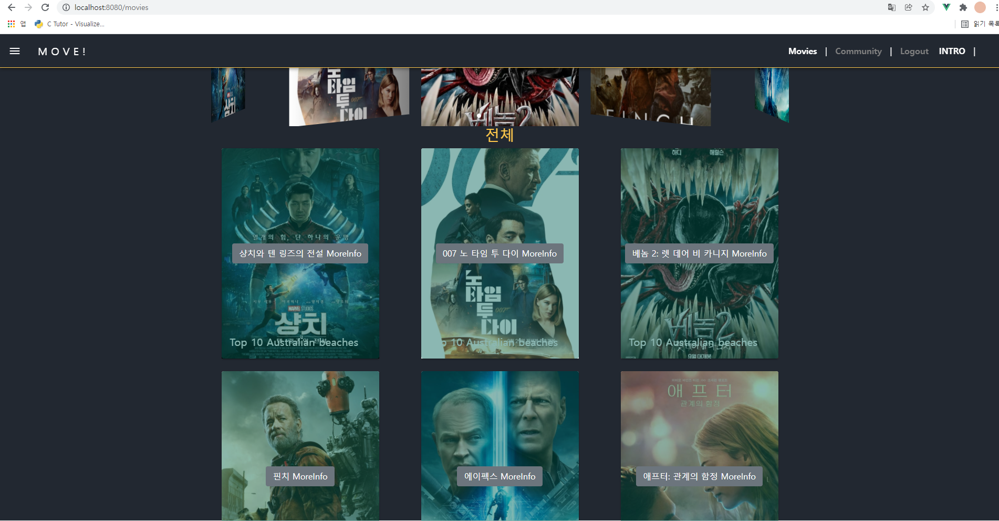
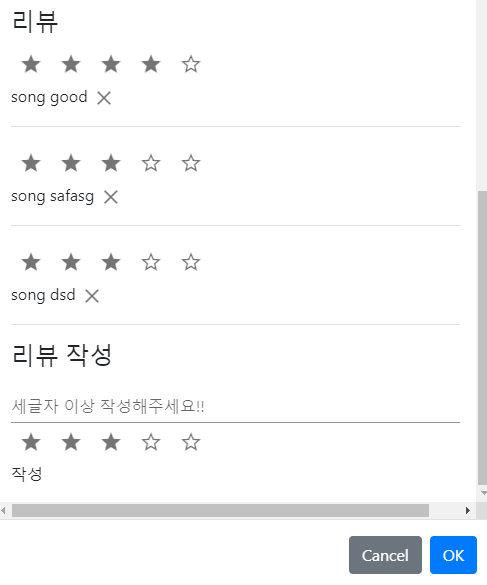
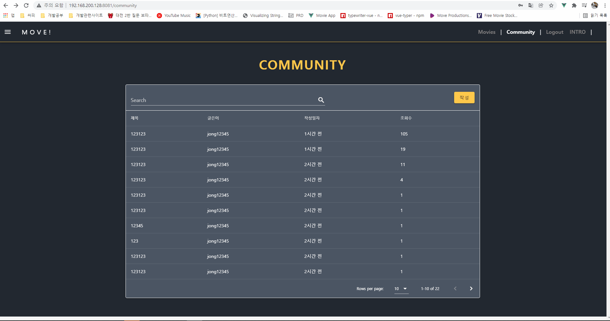
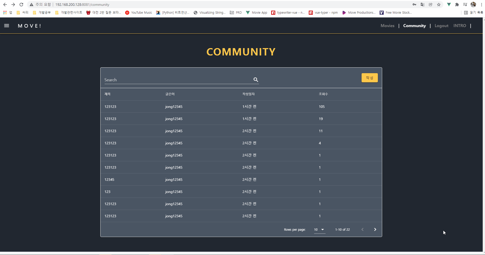
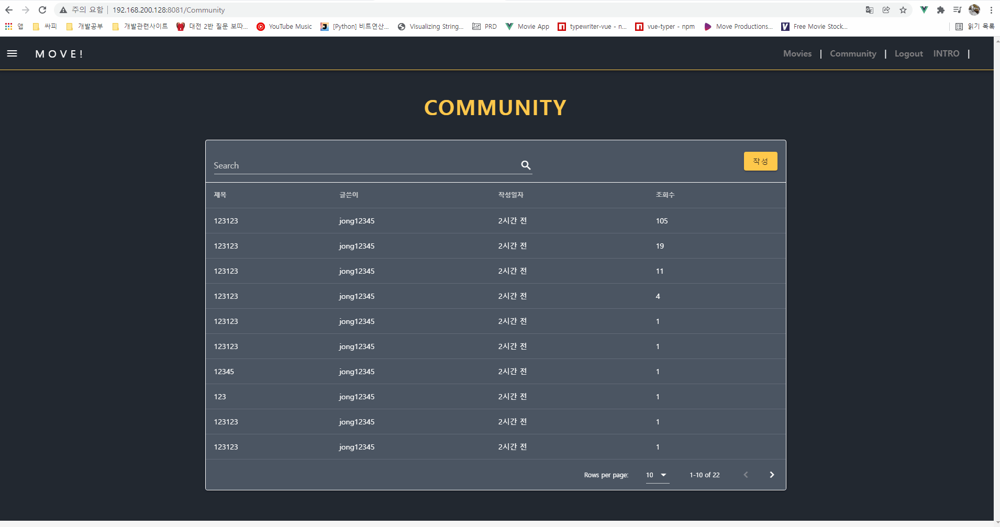

# 1120.22 5일차

### 대전2반 송진섭 현종일 

### final_pjt

#### 목표

- [x] 유저의 좋아요 기반 장르 추천 알고리즘 구현
- [x] 좋아요 이상동작 수정
- [x] 이벤트 영화 DB 추가 케러셀 추가
- [x] 리뷰 댓글 디자인 수정
- [x] community 앱 UI 제작
- [x] header 제작

#### 역할 분담 / 할일

진섭 

- 유저의 좋아요 기반 장르 추천 알고리즘 구현
- 좋아요 이상동작 수정
- 이벤트 영화 DB 추가 케러셀 추가
- 리뷰 댓글 디자인 수정

종일 

- community 디자인 수정
- header 수정
- Index UI 제작

협업

- 상호 피드백, 디자인 구상 조율

-----

### 결과 진행 화면

#### 1. 이벤트 케러셀, 추천 알고리즘 구현

#### 2. 이벤트 페이지 모달

#### 3. hover 적용

#### 4. 리뷰 디자인 수정

#### 5. POST LIST & DETAIL

#### 6. POST CREATE

#### 7. POST UPDATE & DELETE

-----

### 송진섭

> ### 배운 것

- django orm 복습

- 유튜브 iframe api key없이 적용

- vutify 

  

> ### 어려웠던점

- 추천 알고리즘을 구현하며 ManyRelatedManager' object is not iterable

  => shell_plus를 통해 ORM을 공식문서를 통해 복습하며 해결
  
  

> ### 느낀점

- 오늘은 모든일이 술술 풀려서 즐거웠다. 큰 어려움없이 지나가는 하루다. 매일 이러면 좋겠다.
- 마지막에 hover를 적용해 보았다. 하지만 모달이 바로 사라지는 문제가 발생했다. 우선순위가 아니기 때문에 뒤로 미뤘지만 모달과 hover를 동시에 적용하는 방법이 있는지 찾아봐야겠다.

### 현종일

> ### 배운 것

- Bootstrap 대신 Vuetify를 사용하기로 페어와 상의했는데 생각보다 괜찮은 컴포넌트가 많은 것 같습니다.

> ### 어려웠던점

- CSS는 언제나 너무 어렵습니다.. 이쁘게 디자인하는 능력이 전혀 없는 것 같습니다....

> ### 느낀점

- 사용자에게 직접적으로 보여지는 UI단을 구성하는게 굉장히 어려운 일이라는 걸 다시 한 번 깨달았습니다. 최대한 UX와 디자인적 요소를 고려해서 UI단을 구성하도록 노력해야겠습니다 ㅠㅠ
