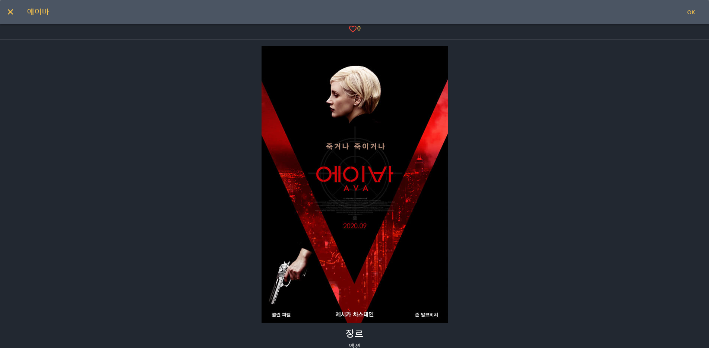
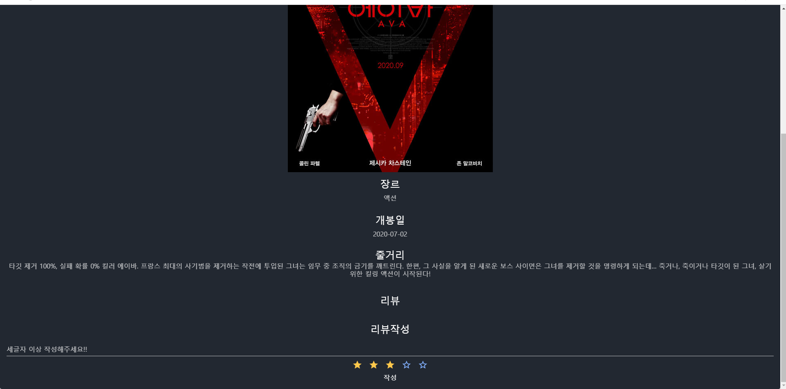
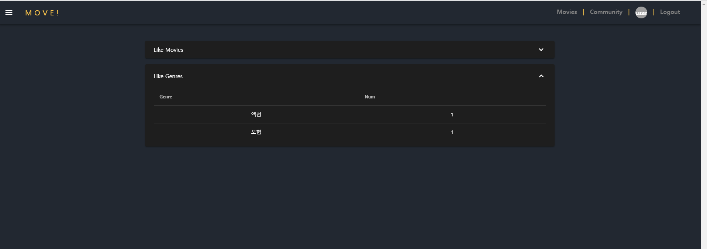
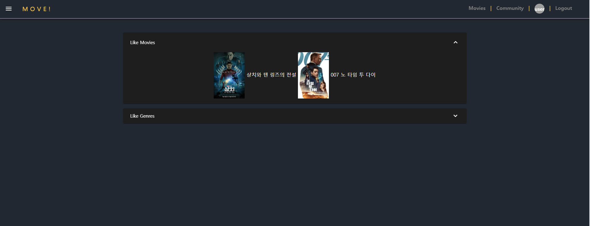
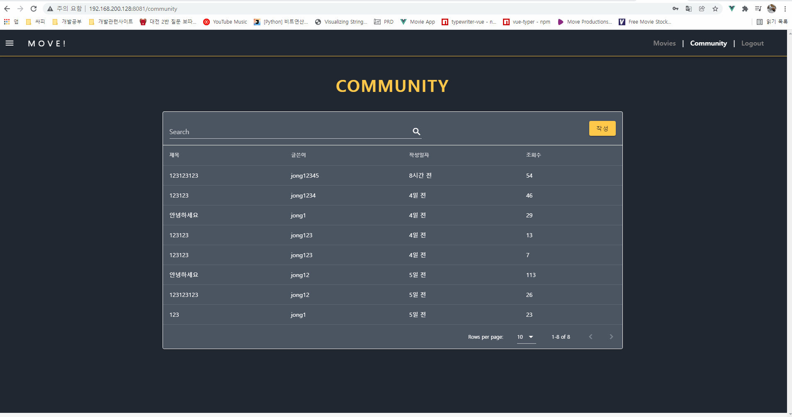

# 1123 6일차

### 대전2반 송진섭 현종일 

### final_pjt

#### 목표

- [ ] 무한 스크롤 구현
- [x] 프로필 추가
- [x] 모달 디자인 수정
- [x] community 앱 UI 제작
- [x] Intro 페이지 제작 및 커뮤니티 디테일페이지 수정

#### 역할 분담 / 할일

진섭 

- 무한 스크롤 구현
- 프로필 페이지 추가
- 모달 디자인 수정

종일 

- Intro 페이지 제작 및 커뮤니티 디테일페이지 수정

협업

- 상호 피드백, 디자인 구상 조율

### 결과 진행 화면

#### 1. 모달 디자인 수정

#### 2. 프로필 페이지 추가

#### 3. INTRO

#### 4. LOGIN

#### 5. POST DETAIL

-----

### 송진섭

> ### 배운 것

-  vue-infinite-loading 적용방법

  

> ### 어려웠던점

- 무한 스크롤 문서의 예시가 router로 되어있지 않아 하위 컴포넌트의 경우 어떻게 적용할지 어려웠다. 결국 해결하지 못했다.

> ### 느낀점

- 어제 늦게까지 좀 더 세련되게 꾸미고 싶어 이것 저것 해봤더니 오늘 오전에는 컨디션이 좋지 않았다. 남은 기간 컨디션 관리를 잘 해서 마무리 해야겠다.

### 현종일

> ### 배운 것

- 컴포넌트 조작 및 video background 사용법에 대해 배웠습니다.

> ### 어려웠던점

- Intro 페이지 제작중에 vuetify의 css와 충돌이나서 한참 고생했습니다. 조잡하게 인라인 css들이 너무 많아서 나중에 수정해야 될 것 같습니다.

> ### 느낀점

- 아직까지는 간단한 결과물을 만들기 때문에 백엔드보다 프론트엔드가 훨씬 어려운 것 같습니다. 아직까지는 결과물이 완전하게 만족스럽진 않지만 최대한 만족스러운 결과물로 제출하도록 노력하려고 합니다.
