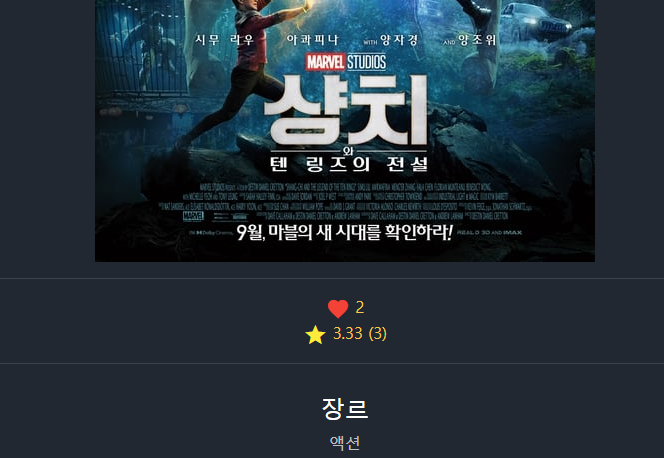
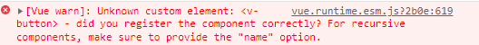
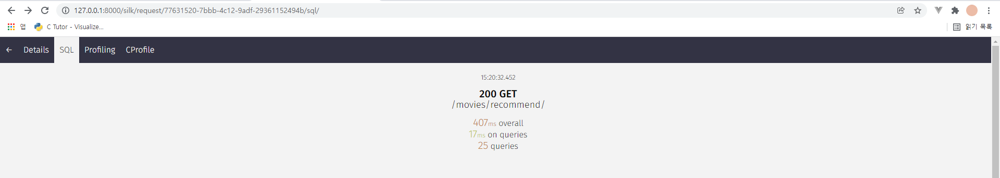

# 1124 7일차

### 대전2반 송진섭 현종일 

### final_pjt

#### 목표

- [ ] ORM 공부 쿼리 최적화
- [x] 마무리 디자인 수정
- [x] 프로젝트 마무리

#### 역할 분담 / 한일

진섭 

- ORM 공부
- 모달 디자인 수정
- 에러 수정

종일 

- 커뮤니티 디테일 페이지 수정
- 헤더 디자인 수정
- 프로젝트 배포

협업

- 상호 피드백, 디자인 구상 조율

### 결과 화면

#### 1. 모달 디자인 수정

#### 2. 에러 수정

#### 3. django ORM 학습

-----

### 송진섭

> ### 배운 것

-  Django ORM (QuerySet)구조와 원리 그리고 최적화전략 - 김성렬 학습

  

> ### 어려웠던점

- django-toolbar 설치 후 나타나지 않아 오전을 보냈다.

  => django silk를 통해 쿼리문 확인

- 쿼리문을 어떻게 최적화할 지 고민되고 단 시간에 해결 할 수 없었다.

- Unknown custom element 에러

  => 스크립트내에 해당 컴포넌트를 제대로 넣지 않아서 발생하는 에러라고 검색에서 찾았다. 내 문제는 vutify에서 v-button이 아닌 v-btn 태그를 사용해야는 데 버튼 태그를 잘못 써서 발생하는 것이었다.

  

> ### 느낀점

- 에러메세지에 답이 있다. 꼼꼼히 살펴보자.
- 단순히 select_related, prefetch_related를 사용한다고 쿼리문이 최적화 되는 것이 아니다. 좀 더 공부하자

-----

### 현종일

> ### 배운 것

- Aws를 통한 프로젝트 배포방법에 대해 알게되었습니다.

> ### 어려웠던점

- cloud9을 사용했지만 우분투환경에서 커맨드명령어들이 생소해서 강의를보면서 따라치기만 했던 것 같습니다. 나중에 aws를 제대로 한 번 배워봐야겠습니다.

> ### 느낀점

- 거의 마무리 단계까지 오게되었는데 아직도 아쉬운점들이 너무 많습니다. 페어분이 굉장히 열심히 해주셔서 감사하고 내일이면 제출일인데 후회안할만한 결과 나오게 노력해야겠습니다.
